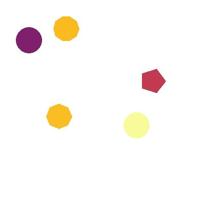

# Simple Scene Graph Generator (SSGG)

This Python script generates images containing simple shapes with unique colors. The script allows you to specify the number of images and the number of elements (shapes) in each image.

## Spatial Reasoning

Spatial reasoning refers to the ability to understand, reason about, and manipulate spatial relationships between objects. In the context of artificial intelligence and machine learning, it is the study of how generative models can learn to recognize, analyze, and predict spatial relationships among objects within an environment.

The dataset generated by this script can be used to investigate the spatial reasoning capabilities of generative models. The images contain simple shapes with varying positions and colors, and the knowledge graphs describe the spatial relationships between these shapes. By training a generative model on this dataset, researchers can evaluate the model's ability to understand, learn, and predict spatial relationships between objects, which is a crucial aspect of many real-world applications, such as robotics, autonomous vehicles, and scene understanding.


## Installation

To install the required packages, run the following command:

```bash
pip install pillow bokeh tqdm
```

## Usage

To run the script, use the following command:

```bash
python generate_shapes.py --num_images=10 --num_elements=5
```
This command will generate 10 images, each containing 5 shapes with random rotations.

Arguments
* `--num_images`: The number of images to generate (default: 1).
* `--num_elements`: The number of unique elements (shapes) to include in each image (default: 5).
* `--width`: The width of the generated images (default: 500).
* `--height`: The height of the generated images (default: 500).

## Output

The output of the `generate_shapes.py` script is a zipped folder containing the generated images and corresponding knowledge graphs. Each image contains the specified number of unique colored shapes, and the knowledge graph describes the shapes, their positions, and colors.

The zip file is named concisely to include the random seed, number of elements, and the height and width of the images, e.g., `generated_images_seed-42_elements-5_width-500_height-500.zip`.

## Examples

<table>
  <tr>
    <th>Image</th>
    <th>Knowledge Graph</th>
  </tr>
  <tr>
    <td></td>
    <td><pre>
Element_1 has_shape octagon.
Element_1 has_colour #C93F4A.
Element_1 has_position (303, 107).
Element_1 is_positioned_top-left_of Element_2.
Element_1 is_positioned_bottom-left_of Element_3.
Element_1 is_positioned_left_of Element_4.
Element_1 is_positioned_bottom_of Element_5.
Element_2 has_shape octagon.
Element_2 has_colour #BF3951.
Element_2 has_position (181, 10).
Element_2 is_positioned_bottom-right_of Element_1.
Element_2 is_positioned_bottom-left_of Element_3.
Element_2 is_positioned_bottom-left_of Element_4.
Element_2 is_positioned_bottom-right_of Element_5.
Element_3 has_shape pentagon.
Element_3 has_colour #62146E.
Element_3 has_position (29, 279).
Element_3 is_positioned_top-right_of Element_1.
Element_3 is_positioned_top-right_of Element_2.
Element_3 is_positioned_top-right_of Element_4.
Element_3 is_positioned_right_of Element_5.
Element_4 has_shape decagon.
Element_4 has_colour #8E2468.
Element_4 has_position (109, 137).
Element_4 is_positioned_right_of Element_1.
Element_4 is_positioned_top-right_of Element_2.
Element_4 is_positioned_bottom-left_of Element_3.
Element_4 is_positioned_right_of Element_5.
Element_5 has_shape decagon.
Element_5 has_colour #F57E14.
Element_5 has_position (325, 180).
Element_5 is_positioned_top_of Element_1.
Element_5 is_positioned_top-left_of Element_2.
Element_5 is_positioned_left_of Element_3.
Element_5 is_positioned_left_of Element_4.
    </pre></td>
  </tr>
  <tr>
    <td></td>
    <td><pre>
Element_1 has_shape octagon.
Element_1 has_colour #FABD23.
Element_1 has_position (90, 202).
Element_1 is_positioned_right_of Element_2.
Element_1 is_positioned_top_of Element_3.
Element_1 is_positioned_right_of Element_4.
Element_1 is_positioned_top_of Element_5.
Element_2 has_shape circle.
Element_2 has_colour #F7FB99.
Element_2 has_position (241, 219).
Element_2 is_positioned_left_of Element_1.
Element_2 is_positioned_top-left_of Element_3.
Element_2 is_positioned_top_of Element_4.
Element_2 is_positioned_top-left_of Element_5.
Element_3 has_shape circle.
Element_3 has_colour #801F6B.
Element_3 has_position (31, 53).
Element_3 is_positioned_bottom_of Element_1.
Element_3 is_positioned_bottom-right_of Element_2.
Element_3 is_positioned_right_of Element_4.
Element_3 is_positioned_right_of Element_5.
Element_4 has_shape pentagon.
Element_4 has_colour #C13A50.
Element_4 has_position (273, 133).
Element_4 is_positioned_left_of Element_1.
Element_4 is_positioned_bottom_of Element_2.
Element_4 is_positioned_left_of Element_3.
Element_4 is_positioned_top-left_of Element_5.
Element_5 has_shape decagon.
Element_5 has_colour #FABB21.
Element_5 has_position (104, 31).
Element_5 is_positioned_bottom_of Element_1.
Element_5 is_positioned_bottom-right_of Element_2.
Element_5 is_positioned_left_of Element_3.
Element_5 is_positioned_bottom-right_of Element_4.
    </pre></td>
  </tr>
  <tr>
    <td></td>
    <td><pre>
Element_1 has_shape hexagon.
Element_1 has_colour #0F092D.
Element_1 has_position (131, 238).
Element_1 is_positioned_bottom-right_of Element_2.
Element_1 is_positioned_top-left_of Element_3.
Element_1 is_positioned_right_of Element_4.
Element_1 is_positioned_top-right_of Element_5.
Element_2 has_shape decagon.
Element_2 has_colour #D94D3D.
Element_2 has_position (281, 325).
Element_2 is_positioned_top-left_of Element_1.
Element_2 is_positioned_top-left_of Element_3.
Element_2 is_positioned_top_of Element_4.
Element_2 is_positioned_top_of Element_5.
Element_3 has_shape octagon.
Element_3 has_colour #290B54.
Element_3 has_position (6, 75).
Element_3 is_positioned_bottom-right_of Element_1.
Element_3 is_positioned_bottom-right_of Element_2.
Element_3 is_positioned_bottom-right_of Element_4.
Element_3 is_positioned_right_of Element_5.
Element_4 has_shape decagon.
Element_4 has_colour #C23B4F.
Element_4 has_position (271, 187).
Element_4 is_positioned_left_of Element_1.
Element_4 is_positioned_bottom_of Element_2.
Element_4 is_positioned_top-left_of Element_3.
Element_4 is_positioned_top_of Element_5.
Element_5 has_shape triangle.
Element_5 has_colour #F6FA95.
Element_5 has_position (226, 47).
Element_5 is_positioned_bottom-left_of Element_1.
Element_5 is_positioned_bottom_of Element_2.
Element_5 is_positioned_left_of Element_3.
Element_5 is_positioned_bottom_of Element_4.
    </pre></td>
  </tr>
</table>


## License
MIT License

Copyright (c) 2023 Simple Shapes Generator

Permission is hereby granted, free of charge, to any person obtaining a copy
of this software and associated documentation files (the "Software"), to deal
in the Software without restriction, including without limitation the rights
to use, copy, modify, merge, publish, distribute, sublicense, and/or sell
copies of the Software, and to permit persons to whom the Software is
furnished to do so, subject to the following conditions:

The above copyright notice and this permission notice shall be included in all
copies or substantial portions of the Software.

THE SOFTWARE IS PROVIDED "AS IS", WITHOUT WARRANTY OF ANY KIND, EXPRESS OR
IMPLIED, INCLUDING BUT NOT LIMITED TO THE WARRANTIES OF MERCHANTABILITY,
FITNESS FOR A PARTICULAR PURPOSE AND NONINFRINGEMENT. IN NO EVENT SHALL THE
AUTHORS OR COPYRIGHT HOLDERS BE LIABLE FOR ANY CLAIM, DAMAGES OR OTHER
LIABILITY, WHETHER IN AN ACTION OF CONTRACT, TORT OR OTHERWISE, ARISING FROM,
OUT OF OR IN CONNECTION WITH THE SOFTWARE OR THE USE OR OTHER DEALINGS IN THE
SOFTWARE.
