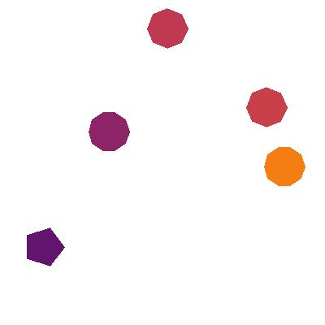
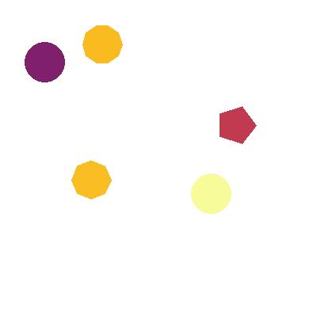
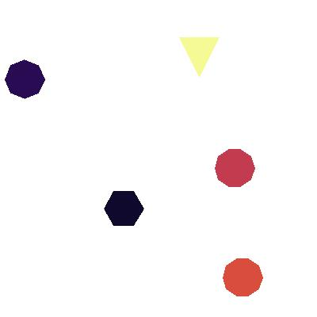
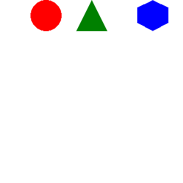
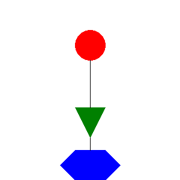
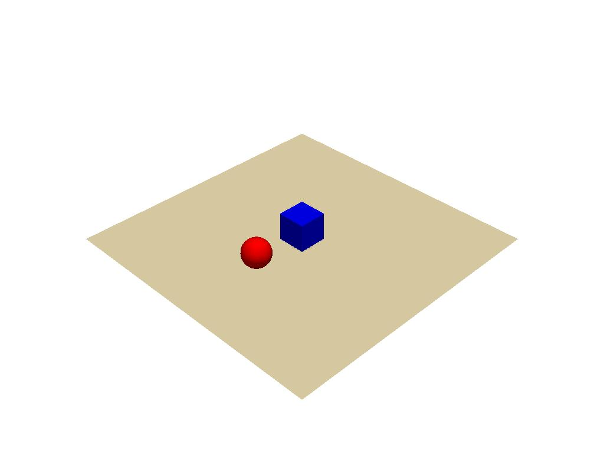

<p  align="center">
    
<p>

---

SSGG generates images containing simple shapes with unique colors. The library allows you to specify various features 
of the images, including but not limited to the number of images and the number of elements (shapes) in each image. 
This dataset would be investigate the spatial reasoning capabilities of machine learning models. Researchers can 
evaluate the model's ability to understand, learn, and predict spatial relationships between objects, which is a 
crucial aspect of many real-world applications, such as robotics, autonomous vehicles, and scene understanding.

## TODO

- [x] Make this into a class and installable.
- [ ] Add extra functions to the class: check for overlaps, split into train/valid/test, zip images and scene graphs.
- [ ] Modify script so that each shape only appears once in each image.
- [ ] Guarantee that the splits are not overlapping.
- [ ] Variable number of elements per image. (Currently this is fixed.).

- [ ] Create different variations of this dataset (easy/intermediate/difficult)

* Ask Paul: Do we want to register this with Zenodo. If so, add DOI badge here.
* Ask Paul: How to generate dataset metadata? Is it needed?
* Ask Paul: When to register dataset? Before or after publication?
* Ask Paul: Where to put the dataset so that it lasts? (Zenodo, GitHub, etc.)
* Ask Peter/Paul: Do we want to make it available on PyPI? If so, add badge here.
* Make GitHub repo anonymous before submission

## Installation

To install SSGG locally, simply:

```bash
pip install -e .
```

## Usage

To run the script, use the following command:

```bash
python generate_shapes.py --num_images=10 --num_elements=5
```

This command will generate 10 images, each containing 5 shapes with random rotations.

Arguments

* `--num_images`: The number of images to generate (default: 1).
* `--num_elements`: The number of unique elements (shapes) to include in each image (default: 5).
* `--width`: The width of the generated images (default: 500).
* `--height`: The height of the generated images (default: 500).
* `--seed`: The random seed to use (default: 42).

## Scene Graph

The knowledge graph is a textual representation of the spatial relationships between elements (shapes) in an image. It
consists of statements describing attributes and relative positions of elements:

1. **Unique Identifier**: `element_{i}`, where `{i}` is the index of the element.
2. **Attributes**:
    - `element_{i} has_shape {shape}`: Shape of the element (e.g., circle, square, triangle).
    - `element_{i} has_position {position}`: Position (x, y) of the element.
    - `element_{i} has_colour {color}`: Color of the element (from Bokeh Inferno palette).
3. **Relative Positions**:
    - `element_{i} is_positioned_{direction}_of element_{j}`: Relative position of `{i}` with respect to `{j}`
      . `{direction}` can be: left, right, above, below, top_left, top_right, bottom_left, or bottom_right.

Each statement is on a separate line. The knowledge graph provides a structured, human-readable description of the
spatial relationships between elements, useful for training and evaluating generative models on spatial reasoning tasks.

## Checking Semantics

To check the semantics of the scene graphs generated by the generate_shapes.py script, you can run the
check_semantics.py script. This script takes a knowledge graph file as input and checks that the relations and entities
in the graph are valid.

To run the script, you can use the following command:

```
python check_semantics.py <knowledge_graph_file>
```

Replace <knowledge_graph_file> with the path to a knowledge graph file. The script will print out any errors it finds in
the knowledge graph.

## Output

The output of the `generate_shapes.py` script is a zipped folder containing the generated images and corresponding scene
graphs. Each image contains the specified number of unique colored shapes, and the knowledge graph describes the shapes,
their positions, and colors.

The zip file is named concisely to include the random seed, number of elements, and the height and width of the images,
e.g., `SSGG5_10000_(500x500)_seed42.zip`.

### Data Split

The generate_shapes.py script generates three splits of the dataset: train, validation, and test. By default, the script
generates 70% of the images for the train split, 20% for the validation split, and 10% for the test split.

## Examples

<table>
  <tr>
    <th>Image</th>
    <th>Knowledge Graph</th>
  </tr>
  <tr>
    <td></td>
    <td><pre>
Element_1 has_shape octagon.
Element_1 has_colour #C93F4A.
Element_1 has_position (303, 107).
Element_1 is_positioned_top-left_of Element_2.
Element_1 is_positioned_bottom-left_of Element_3.
Element_1 is_positioned_left_of Element_4.
Element_1 is_positioned_bottom_of Element_5.
Element_2 has_shape octagon.
Element_2 has_colour #BF3951.
Element_2 has_position (181, 10).
Element_2 is_positioned_bottom-right_of Element_1.
Element_2 is_positioned_bottom-left_of Element_3.
Element_2 is_positioned_bottom-left_of Element_4.
Element_2 is_positioned_bottom-right_of Element_5.
Element_3 has_shape pentagon.
Element_3 has_colour #62146E.
Element_3 has_position (29, 279).
Element_3 is_positioned_top-right_of Element_1.
Element_3 is_positioned_top-right_of Element_2.
Element_3 is_positioned_top-right_of Element_4.
Element_3 is_positioned_right_of Element_5.
Element_4 has_shape decagon.
Element_4 has_colour #8E2468.
Element_4 has_position (109, 137).
Element_4 is_positioned_right_of Element_1.
Element_4 is_positioned_top-right_of Element_2.
Element_4 is_positioned_bottom-left_of Element_3.
Element_4 is_positioned_right_of Element_5.
Element_5 has_shape decagon.
Element_5 has_colour #F57E14.
Element_5 has_position (325, 180).
Element_5 is_positioned_top_of Element_1.
Element_5 is_positioned_top-left_of Element_2.
Element_5 is_positioned_left_of Element_3.
Element_5 is_positioned_left_of Element_4.
    </pre></td>
  </tr>
  <tr>
    <td></td>
    <td><pre>
Element_1 has_shape octagon.
Element_1 has_colour #FABD23.
Element_1 has_position (90, 202).
Element_1 is_positioned_right_of Element_2.
Element_1 is_positioned_top_of Element_3.
Element_1 is_positioned_right_of Element_4.
Element_1 is_positioned_top_of Element_5.
Element_2 has_shape circle.
Element_2 has_colour #F7FB99.
Element_2 has_position (241, 219).
Element_2 is_positioned_left_of Element_1.
Element_2 is_positioned_top-left_of Element_3.
Element_2 is_positioned_top_of Element_4.
Element_2 is_positioned_top-left_of Element_5.
Element_3 has_shape circle.
Element_3 has_colour #801F6B.
Element_3 has_position (31, 53).
Element_3 is_positioned_bottom_of Element_1.
Element_3 is_positioned_bottom-right_of Element_2.
Element_3 is_positioned_right_of Element_4.
Element_3 is_positioned_right_of Element_5.
Element_4 has_shape pentagon.
Element_4 has_colour #C13A50.
Element_4 has_position (273, 133).
Element_4 is_positioned_left_of Element_1.
Element_4 is_positioned_bottom_of Element_2.
Element_4 is_positioned_left_of Element_3.
Element_4 is_positioned_top-left_of Element_5.
Element_5 has_shape decagon.
Element_5 has_colour #FABB21.
Element_5 has_position (104, 31).
Element_5 is_positioned_bottom_of Element_1.
Element_5 is_positioned_bottom-right_of Element_2.
Element_5 is_positioned_left_of Element_3.
Element_5 is_positioned_bottom-right_of Element_4.
    </pre></td>
  </tr>
  <tr>
    <td></td>
    <td><pre>
Element_1 has_shape hexagon.
Element_1 has_colour #0F092D.
Element_1 has_position (131, 238).
Element_1 is_positioned_bottom-right_of Element_2.
Element_1 is_positioned_top-left_of Element_3.
Element_1 is_positioned_right_of Element_4.
Element_1 is_positioned_top-right_of Element_5.
Element_2 has_shape decagon.
Element_2 has_colour #D94D3D.
Element_2 has_position (281, 325).
Element_2 is_positioned_top-left_of Element_1.
Element_2 is_positioned_top-left_of Element_3.
Element_2 is_positioned_top_of Element_4.
Element_2 is_positioned_top_of Element_5.
Element_3 has_shape octagon.
Element_3 has_colour #290B54.
Element_3 has_position (6, 75).
Element_3 is_positioned_bottom-right_of Element_1.
Element_3 is_positioned_bottom-right_of Element_2.
Element_3 is_positioned_bottom-right_of Element_4.
Element_3 is_positioned_right_of Element_5.
Element_4 has_shape decagon.
Element_4 has_colour #C23B4F.
Element_4 has_position (271, 187).
Element_4 is_positioned_left_of Element_1.
Element_4 is_positioned_bottom_of Element_2.
Element_4 is_positioned_top-left_of Element_3.
Element_4 is_positioned_top_of Element_5.
Element_5 has_shape triangle.
Element_5 has_colour #F6FA95.
Element_5 has_position (226, 47).
Element_5 is_positioned_bottom-left_of Element_1.
Element_5 is_positioned_bottom_of Element_2.
Element_5 is_positioned_left_of Element_3.
Element_5 is_positioned_bottom_of Element_4.
    </pre></td>
  </tr>
</table>

## Future Work

### Video clips

It would be simple to animate these 2D shapes. It would be make it a good testbed for developing casual reasoning models.

<p  align="center">
    
<p>

<p  align="center">
    
<p>

<p  align="center">
    
<p>

### 3D Shapes Generation

It is very straightforward to generate 3D shapes using the same approach. The only difference is that we need to
generate 3D coordinates instead of 2D coordinates. Here is a test:

<p  align="center">
    
<p>

This would enable testing more challenging spatial reasoning problems.

### Inductive Setting

It would be very useful doing the data split such that it allows for inductive setting.

## License

MIT License

Copyright (c) 2023 Thiviyan Thanapalasingam
